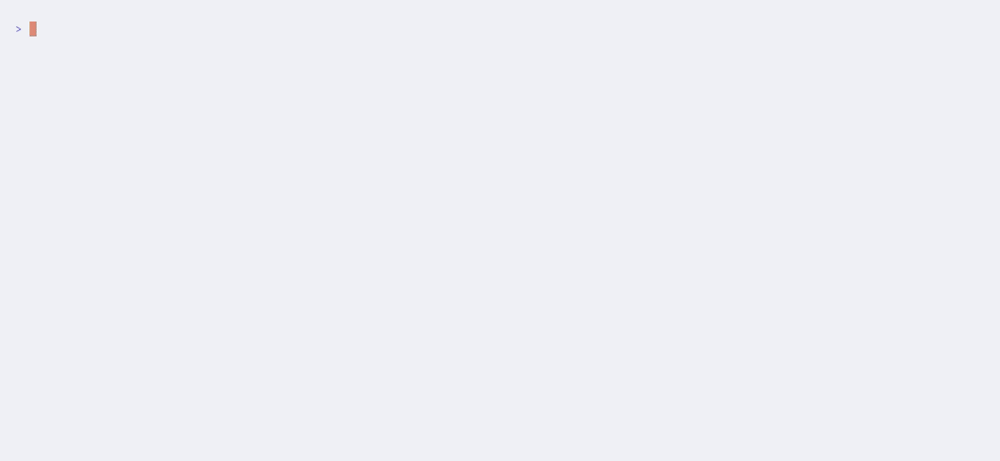

# chooz

> Interactive terminal menu driven by a YAML file. Think `gum choose` + `fzf --preview`.

`chooz` renders a selectable list with a description preview pane. On selection the
chosen item's **`name`** is written to stdout — making it a first-class shell citizen:

```bash
RESULT=$(chooz menu.yaml)
```

The TUI always renders to stderr / `/dev/tty` so it never pollutes the captured output.

---

## Demo

**Basic selection** — navigate with arrows or `j`/`k`, preview pane updates live, `Enter` prints the name to stdout:


**Themes — dark terminal** — `--theme <slug>` picks a named theme; `chooz theme-showroom` lets you browse all 16 interactively:


**Themes — light terminal:**



---

## Features

- **Preview pane** — multi-line item descriptions rendered alongside the list
- **CI-friendly** — non-interactive mode via `--default` or a positional name argument
- **Theme system** — 16 built-in themes (dark, light, adaptive); pick one via `--theme` or `CHOOZ_THEME`
- **Shell completion** — tab-complete file paths and item names (bash / zsh / fish)
- **Zero runtime deps** — single, statically linked binary; no CGO

---

## Installation

### Homebrew (macOS / Linux)

```bash
brew tap sumpfgottheit/chooz
brew install chooz
```

### Debian / Ubuntu

```bash
curl -fsSL https://sumpfgottheit.github.io/packages/gpg.key \
  | sudo gpg --dearmor -o /etc/apt/keyrings/sumpfgottheit.gpg

echo "deb [signed-by=/etc/apt/keyrings/sumpfgottheit.gpg] \
  https://sumpfgottheit.github.io/packages/apt stable main" \
  | sudo tee /etc/apt/sources.list.d/chooz.list

sudo apt update && sudo apt install chooz
```

### Fedora / RHEL / CentOS

```bash
sudo rpm --import https://sumpfgottheit.github.io/packages/gpg.key

sudo tee /etc/yum.repos.d/chooz.repo <<'EOF'
[chooz]
name=chooz packages
baseurl=https://sumpfgottheit.github.io/packages/rpm/$basearch/
enabled=1
gpgcheck=1
gpgkey=https://sumpfgottheit.github.io/packages/gpg.key
EOF

sudo dnf install chooz
```

### Binary download

Pre-built binaries for Linux (amd64/arm64) and macOS (amd64/arm64) are available on the
[Releases page](https://github.com/sumpfgottheit/chooz/releases). Each release includes a
`checksums.txt` for verification.

### From source

```bash
git clone https://github.com/sumpfgottheit/chooz
cd chooz
make static        # CGO_ENABLED=0, trimpath, stripped
sudo mv chooz /usr/local/bin/
```

### Vendored / airgapped build

```bash
go mod vendor
go build -mod=vendor -o chooz .
```

---

## Usage

```
chooz [flags] <file.yaml> [name]
```

| Argument / Flag | Description |
|---|---|
| `<file.yaml>` | Path to the menu YAML (use `-` to read from stdin) |
| `[name]` | Non-interactive: validate and print this item name, then exit 0 |
| `-d, --default <name>` | Pre-highlight in interactive mode; CI fallback when no TTY |
| `--theme <slug>` | Color theme (see list below) |
| `-l, --list` | Print all item names, one per line, and exit |
| `-n, --non-interactive` | Never draw a TUI; requires `[name]` or `--default` |
| `--height <n>` | Max visible list rows |
| `--no-color` | Disable all ANSI styling |
| `-h, --help` | Show help |
| `--version` | Print version |

### Interactive menu

```bash
chooz menu.yaml              # launch TUI; print selected name on Enter
chooz --default prod menu.yaml   # start with "prod" highlighted
chooz --theme nord menu.yaml     # use the Nord theme
```

### Non-interactive / CI

```bash
# positional name
chooz menu.yaml prod          # prints "prod", exit 0

# --default as CI fallback (no TUI drawn when stdout is not a TTY)
DEPLOY_ENV=$(chooz --default stage menu.yaml)

# print all names
chooz -l menu.yaml
```

### Key bindings

| Key | Action |
|---|---|
| `↑` / `k` | Move up |
| `↓` / `j` | Move down |
| `g` / `G` | Jump to top / bottom |
| `PgUp` / `PgDn` | Scroll preview pane |
| `Enter` | Select (exit 0) |
| `Esc` / `Ctrl-C` / `q` | Cancel (exit 130) |

---

## YAML format

```yaml
title: "Select a target environment"    # optional header
description: "Pick where to deploy."   # optional help text

items:                                  # required, must be non-empty
  - name: prod                          # required; pattern: [A-Za-z0-9]+
    title: "Production"                 # optional display label (default: name)
    description: |                      # optional, multi-line
      Live cluster. Handle with care.
      All changes go live immediately.

  - name: stage
    title: "Staging"
    description: "Pre-production environment."

  - name: dev                           # minimal: only name required

theme:
  name: nord                            # optional; same as --theme nord
```

**Validation rules:**
- `items` is required and must be non-empty
- Each `name` must match `[A-Za-z0-9]+` (no spaces, hyphens, or underscores)
- `name` values must be unique
- Unknown keys are silently ignored — forward-compatible by design

---

## Themes

Select with `--theme <slug>` or `CHOOZ_THEME=<slug>`. The terminal background is never overridden.

Themes come in three variants:
- **dark** — fixed palette designed for dark terminals
- **light** — fixed palette designed for light terminals
- **adaptive** — palette shifts automatically based on the terminal's detected background

| Slug | Name | Type |
|---|---|---|
| `gum` | Gum (charm.sh) — **default** | dark |
| `gruvbox-dark` | Gruvbox Dark | dark |
| `nord` | Nord | dark |
| `dracula` | Dracula | dark |
| `catppuccin-mocha` | Catppuccin Mocha | dark |
| `tokyo-night` | Tokyo Night | dark |
| `gruvbox-light` | Gruvbox Light | light |
| `solarized-light` | Solarized Light | light |
| `catppuccin-latte` | Catppuccin Latte | light |
| `one-light` | One Light | light |
| `rose-pine-dawn` | Rosé Pine Dawn | light |
| `solarized` | Solarized | adaptive |
| `everforest` | Everforest | adaptive |
| `rose-pine` | Rosé Pine | adaptive |
| `kanagawa` | Kanagawa | adaptive |
| `base16` | base16 Default | adaptive |

List all themes with their variant:

```bash
chooz themes
```

Browse all themes interactively:

```bash
chooz theme-showroom
```

---

## Environment variables

| Variable | Description |
|---|---|
| `CHOOZ_THEME` | Theme slug; overridden by `--theme` |
| `NO_COLOR` | Disable all ANSI styling |
| `CLICOLOR_FORCE` | Keep colors even when output is not a TTY |

---

## Shell completion

```bash
# Bash (add to ~/.bashrc to persist)
source <(chooz completion bash)

# Zsh (add to ~/.zshrc to persist)
source <(chooz completion zsh)

# Fish
chooz completion fish | source
```

Once active, tab-completion works for both arguments:

```bash
chooz <TAB>            # completes .yaml / .yml files
chooz menu.yaml <TAB>  # completes item names from that file
```

---

## Exit codes

| Code | Meaning |
|---|---|
| `0` | Item selected/resolved; name printed to stdout |
| `1` | Runtime error (bad YAML, name not found, no TTY without selection) |
| `2` | Usage error (bad flags or missing argument) |
| `130` | User cancelled (Esc, Ctrl-C, or `q`) |

---

## Build targets

```bash
make build    # standard build
make static   # CGO_ENABLED=0, trimpath, stripped
make tiny     # static + upx --best (requires upx)
make test     # go test ./...
make lint     # golangci-lint run
make vendor   # go mod vendor
make clean    # remove binary
```

---

## Tech stack

- **Language:** Go 1.24+, `CGO_ENABLED=0`
- **TUI:** [Bubble Tea](https://github.com/charmbracelet/bubbletea) · [Bubbles](https://github.com/charmbracelet/bubbles) · [Lip Gloss](https://github.com/charmbracelet/lipgloss)
- **YAML:** `gopkg.in/yaml.v3`
- **CLI:** [Cobra](https://github.com/spf13/cobra)

## Authors

- Idea: @sumpfgottheit
- Planing: Opus 4.8
- Implementing: Sonnet 4.6
- Reviewers: ChatGPT 5.5, Gemini Pro 3.1